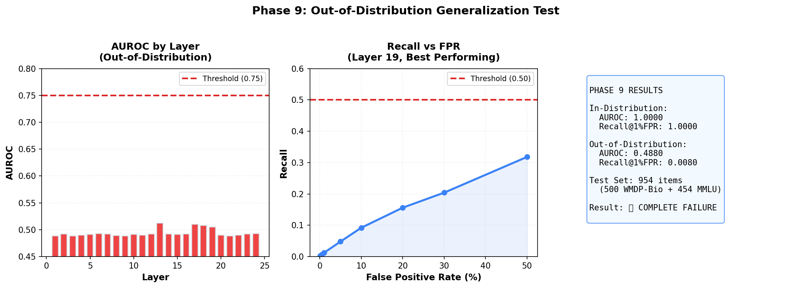

# Bio Capability Probing

A confound-controlled falsification study of linear probes for biological dual-use capability detection in language models.

---

## Summary

This project tests whether the standard small-N linear probing protocol detects biological dual-use capability in language model activations, or produces misleading signal driven by lexical artifacts and high-dimensional memorization.

Across nine phases of increasingly stringent evaluation — vocabulary controls, paraphrase attacks, scaffolded scenarios, sparsity diagnostics, same-family replication, and held-out benchmark testing — probes achieving perfect in-distribution AUROC (1.0) collapse to chance performance (0.488) on 954 held-out WMDP-Bio and MMLU items. Recall at 1% FPR peaks at 0.008, against a 0.50 operational threshold.

The Phase 6 sparsity analysis was consistent with this outcome: perfect in-distribution AUROC is achievable with five features out of 1024, a pattern consistent with memorization in high-dimensional space at small N.

The hypothesis was falsified. Activation-space linear probes trained on small hand-authored datasets are not ready for operational biological capability detection without held-out benchmark validation. This repository documents the protocol that produced the falsification and the diagnostic that catches the failure mode early.

**Preprint:** Ochola, A. (2026). *Bio Capability Probing: A Confound-Controlled Falsification Study of Linear Probes for Biological Dual-Use Capability Detection.* Zenodo v2.1. [doi.org/10.5281/zenodo.20244912](https://doi.org/10.5281/zenodo.20244912)

---

## Headline Result: The Falsification



*Figure 1. Phase 9 out-of-distribution evaluation on 954 held-out WMDP-Bio and MMLU biology items. **Left:** AUROC by layer; all 24 layers cluster near 0.49, failing the 0.75 threshold. **Centre:** Recall at false positive rate curve for the best layer; peak Recall@1%FPR is 0.008, well below the 0.50 operational threshold. **Right:** Summary metrics. Both criteria fail. In-distribution separability does not survive distribution shift.*

| Metric | In-distribution (Phases 2–8) | Out-of-distribution (Phase 9) |
|---|---|---|
| N | 10 | 954 |
| AUROC | 1.000 | 0.488 |
| Recall @ 1% FPR | — | 0.008 |
| Operational threshold | — | 0.50 |
| Result | Saturated | Falsified |

---

## The Diagnostic Consistent with the Failure Mode

The Phase 6 sparsity analysis is the methodological core of the study. For each transformer layer, we identified the minimum number of features (out of 1024) required to achieve in-distribution AUROC 1.0, using greedy feature selection by weight magnitude.

**Across all 25 layers of Pythia-410M, perfect AUROC is achievable with five features out of 1024.**

This sparsity profile is consistent with memorization of the N=10 training set in 1024-dimensional activation space rather than detection of a robust distributed feature, although the sparsity result alone does not rule out the possibility that a small number of features genuinely encode the target concept. Phase 9 is consistent with the same interpretation: in this study, the sparsity result was consistent with the later observed generalization failure.

This diagnostic is the contribution most likely to generalize beyond biological capability detection. Any small-N linear probing protocol that achieves saturated metrics with extreme feature sparsity should be considered suspect until validated on held-out benchmarks.

---

## Phase Progression

The nine phases function as an ablation series on the same hypothesis.

| Phase | Test | N | AUROC | Finding |
|---|---|---|---|---|
| 1 | Apollo behavioural baseline | 356 | 0.64 | Weak above-chance signal on authenticated deployment data |
| 2 | Hidden-layer separability | 10 | 1.0 | Uniform saturation across all 25 layers — overfitting flag |
| 3 | Vocabulary control | 10 | 1.0 | ~40% of signal is lexical; remainder survives lexical control |
| 4 | Paraphrase attacks | 10 | 1.0 | 62% vocabulary overlap, no degradation |
| 5 | Scaffold attacks | 10 | 1.0 | 150-word biological research narratives, no degradation |
| 6 | Sparse feature analysis | 10 | 1.0 | 5/1024 features sufficient — **memorization diagnostic** |
| 7 | Same-family replication | 10 | 1.0 | Pythia-410M and GPT-Neo-125M both saturate |
| 8 | Reproducible pipeline | 10 | 1.0 | End-to-end Colab notebook, 4–5 min runtime |
| 9 | Out-of-distribution generalization | 954 | 0.488 | Held-out WMDP-Bio + MMLU — **falsification** |

Phases 2–8 measure in-distribution separability under increasingly stringent confound controls. Phase 6 is the diagnostic that predicts the Phase 9 outcome. Phase 9 is the falsification test on held-out benchmark items.

---

## Phase 9: Layer-by-Layer ROC Curves


*Figure 2. ROC curves for the four best-performing layers under Phase 9 evaluation. All four curves sit below the chance diagonal (AUROC 0.307–0.325 on the labeled orientation; inverted predictions yield AUROC 0.675–0.693, still well below the 0.75 operational threshold and consistent with no robust biological capability signal). The pattern is uniform across the transformer stack; no layer carries a generalizable signal in either polarity under the configurations tested.*

---

## Phase 9 Protocol

**Training set.** N = 10 hand-authored biological capability/control pairs (5 capability, 5 control), all imperative-form prompts.

**Test set.** 954 held-out items with no overlap with training:
- 500 items from WMDP-Bio (multiple choice questions evaluating biosecurity-relevant knowledge; Li et al., 2024)
- 454 items from MMLU biology subjects (multiple choice biology questions)

**Protocol.** Train linear probes on N=10 hand-authored pairs across all 24 transformer layers of Pythia-410M, using frozen weights and mean-pooled hidden states. Evaluate each probe on the 954-item held-out set. Report AUROC by layer and Recall at 1% FPR for the best-performing layer. Bootstrap 95% confidence intervals computed on the Phase 9 metric (N=954).

**Result.** AUROC across all 24 layers clusters between 0.48 and 0.51. Recall@1%FPR peaks at 0.008 against an operational threshold of 0.50. The in-distribution signal does not survive distribution shift.

**Confounds.** Format mismatch (training on imperatives, evaluating on MCQs) is a real distribution shift but also a design confound; the Phase 9 result is consistent with either a generalization failure of the underlying signal or with task misalignment between formats. Disentangling these requires within-format generalization tests not yet run. Cross-family transfer (Mistral, Llama, Gemma, biological foundation models) is untested. N=10 is intentionally small for rapid iteration; N≥100 with WMDP-aligned prompts is the next test.

---

## What This Work Establishes

**A reproducible falsification protocol.** A method for testing whether in-distribution probe metrics reflect genuine feature detection or memorization artifacts in high-dimensional space. The protocol runs end-to-end in 4–5 minutes on a Colab GPU and applies to any linear probing setup.

**A diagnostic whose behaviour was consistent with the failure mode.** The Phase 6 sparsity analysis is consistent with memorization when extreme sparsity (5/1024 features) achieves perfect in-distribution AUROC. In this study, the sparsity result was consistent with the later observed Phase 9 generalization failure. A single co-occurrence at N=1 study scale does not establish predictive validity; whether the diagnostic generalizes across probing setups, model families, and target concepts is an open empirical question.

**A negative result on the standard protocol.** Under the configurations tested — small N, hand-authored prompts, Pythia-410M and GPT-Neo-125M, mean-pooled activations, linear probes — in-distribution separability does not survive evaluation on held-out WMDP-Bio and MMLU items. This is a finding about the protocol, not a final claim about activation-space probing.

**Implementation guidance.** Practitioners deploying activation-space probes for biological capability detection should validate on held-out benchmarks before operational claims. In-distribution metrics at small N are not sufficient evidence of robust feature detection.

---

## Repository Structure

```
bio-capability-probing/
├── notebooks/
│   ├── 01_apollo_baseline.ipynb              # Phase 1
│   ├── 02_biological_probing.ipynb           # Phases 2–3
│   ├── 03_vocabulary_control.ipynb           # Phase 3 (full)
│   ├── 04_paraphrase_attacks.ipynb           # Phase 4
│   ├── 05_scaffold_attacks.ipynb             # Phase 5
│   ├── 06_sparse_features.ipynb              # Phase 6 (diagnostic)
│   ├── 07_same_family_replication.ipynb      # Phase 7
│   ├── 08_reproducible_pipeline.ipynb        # Phase 8
│   └── 09_phase9_wmdp_mmlu_generalization.ipynb  # Phase 9 (falsification)
├── writeups/                                 # Phase-by-phase technical notes
├── figures/                                  # ROC curves, sparsity plots, layer separability
├── results/                                  # Metrics JSON, per-phase outputs
├── requirements.txt
└── README.md
```

---

## Reproducibility

All code is self-contained in Jupyter notebooks. The Phase 9 notebook runs end-to-end in approximately 4–5 minutes on a Colab GPU.

```bash
pip install -r requirements.txt
jupyter notebook notebooks/09_phase9_wmdp_mmlu_generalization.ipynb
```

**Dependencies:** transformers, torch, scikit-learn, datasets, matplotlib, numpy, pandas.

**Models:** Pythia-410M (primary), GPT-Neo-125M (Phase 7 replication).

**Data:** Training prompts hand-authored and included in the repository. WMDP-Bio and MMLU biology subsets loaded from Hugging Face Datasets.

---

## Limitations

**Single model family.** Only Pythia-410M and GPT-Neo-125M tested. Cross-family transfer to Mistral, Llama, Gemma, or biological foundation models is untested.

**Small N.** N=10 is intentionally small for rapid iteration and to surface memorization artifacts. The behavior at N≥100 with WMDP-aligned training data is the next test.

**Hand-authored threat model.** Training prompts encode a specific operationalization of biological dual-use capability. WMDP-Bio and MMLU encode different ones. Task misalignment is a real confound, not just a limitation.

**Format mismatch.** Training on imperative prompts and testing on MCQs is a realistic distribution shift but also a design confound; future work should evaluate within-format generalization first.

**Correlational analysis only.** Linear probing is correlational. Causal claims about the underlying representations require activation patching, sparse autoencoder analysis, or circuit-level work, none of which is performed here.

---

## Future Directions

**Biological foundation models with causal analysis.** Port the Phase 6 sparsity diagnostic and Phase 9 generalization protocol to Evo 2 and ESM-family models. Add activation patching and circuit analysis. Synthesis screening as the deployment target. Timeline: 3–4 weeks.

**Larger N with task-aligned training.** Expand to N≥100 with WMDP-aligned prompts and proper k-fold cross-validation. Test whether the falsification holds at scale or whether N=10 was the critical limiter. Timeline: 2–4 weeks.

**Function-based DNA synthesis screening evaluation.** Apply the confound-controlled evaluation methodology to existing screening systems. Timeline: 2–4 weeks.

---

## Citation

```bibtex
@misc{ochola2026biocapabilityprobing,
  author       = {Ochola, Allan},
  title        = {Bio Capability Probing: A Confound-Controlled Falsification Study
                  of Linear Probes for Biological Dual-Use Capability Detection},
  year         = {2026},
  publisher    = {Zenodo},
  version      = {v2.1},
  doi          = {10.5281/zenodo.20244912},
  url          = {https://doi.org/10.5281/zenodo.20244912}
}
```

---

## License

MIT License. See `LICENSE`.

---

**Status:** Phases 1–9 complete. Preprint v2.1 deposited. Next: cross-family transfer and biological foundation model evaluation.

**Last updated:** May 2026.
