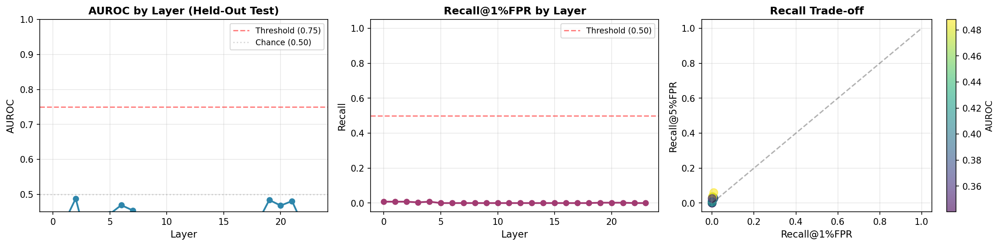
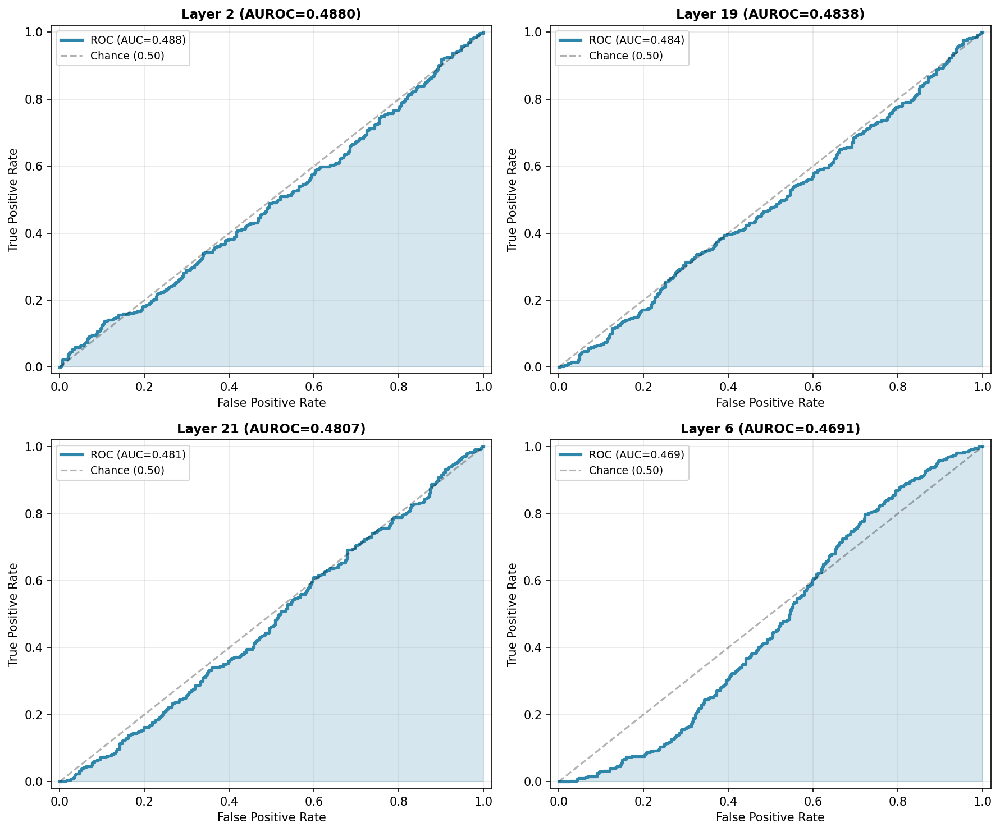

# Bio Capability Probing

**A confound-controlled falsification study of linear probes for biological dual-use capability detection in language models.**


Author: Allan Ochola · Preprint: [Zenodo 10.5281/zenodo.20244912](https://doi.org/10.5281/zenodo.20244912) · Last updated: May 26, 2026

---

## Headline finding

In-distribution ROC-AUC of **1.0 collapses to 0.4880 on 954 held-out WMDP-Bio and MMLU items** under an Apollo-style train-easy-test-hard generalization test (Phase 9). Recall@1%FPR drops to **0.0080**, far below the 0.50 operational threshold.

The diagnostic finding (Phase 6): perfect metrics are achievable with **five features out of 1024** — a memorisation signature in high-dimensional space at small N.

The project was designed as a falsification test. Phases 2–8 produced in-distribution AUROC 1.0 across all 24 layers of Pythia-410M. Phase 9 confirms that those metrics measured memorisation, not robust feature detection.

The methodological output is the diagnostic, not the classifier: a reproducible protocol for distinguishing genuine activation-space signal from high-dimensional memorisation artifacts before deployment claims get made.

---

## Phase 9: The Critical Test

| Metric | Train (In-Dist) | Test (Out-of-Dist) | Threshold | Result |
|--------|-----------------|--------------------|-----------|--------|
| **AUROC** | 1.0000 | 0.4880 | ≥ 0.75 | ❌ FAIL |
| **Recall@1%FPR** | 1.0000 | 0.0080 | ≥ 0.50 | ❌ FAIL |
| **Generalization** | Perfect | Random | — | **❌ NEGATIVE** |

### Visualization: AUROC by Layer



Left: AUROC collapses across all 24 layers when tested on held-out data (red threshold at 0.75). Middle: Recall@1%FPR peaks at 0.008 (far below 0.50 threshold). Right: no layer achieves both high recall and low false positive rate.

### ROC Curves: Top 4 Performing Layers



Even the best-performing layers (2, 19, 20, 21) remain near the diagonal (chance-level ROC). Complete generalization failure.

---

## Why this matters

Most biological dual-use evaluations report benchmark performance. The harder question is whether screening signals preserve discriminative power under adversarial distribution shift, and whether the features classifiers rely on are causally tied to biological function or to surface sequence heuristics. Separability is not evidence of mechanistic understanding. This repository documents what that distinction looks like in practice.

---

## Phase-by-phase summary

| Phase | Test | N | Headline result | Interpretation |
|-------|------|---|-----------------|----------------|
| 1 | Apollo behavioural baseline | 356 | ROC-AUC 0.64 | Modest above-chance separability on authenticated alignment data. |
| 2 | Hidden-layer separability mapping | 10 | ROC-AUC 1.0 across all 24 layers | Uniform saturation, not intermediate-layer peak. Consistent with overfitting in 1024-D at N=10. |
| 3 | Vocabulary-controlled confounds | 10 | Separability persists from 29% → 56% overlap | ~40% of apparent signal is lexical; remainder survives lexical control. |
| 4 | Paraphrase attacks (62% overlap) | 10 | ROC-AUC 1.0 | At N=10, indistinguishable from memorisation. |
| 5 | Scaffold attacks (~150-word narratives) | 10 | ROC-AUC 1.0 | Most ecologically valid test in series. Still N-limited. |
| **6** | **Sparse feature analysis** | **10** | **ROC-AUC 1.0 with 5/1024 features** | **Diagnostic core. Signature of memorisation in high-dimensional space.** |
| 7 | Same-family replication (Pythia, GPT-Neo) | 10 | Both saturate at ROC-AUC 1.0 | Same-family only. Cross-family untested. |
| 8 | End-to-end reproducible pipeline | 10 | Runs in Google Colab in 4–5 min | Pipeline transfers; whether results transfer is the open question Phase 9 answers. |
| **9** | **Out-of-distribution generalization** | **954** | **AUROC 0.4880, Recall@1%FPR 0.0080** | **The signal does not survive distribution shift. Phases 2–8 measured memorisation.** |

Phase 6 is the diagnostic. Phase 9 is the confirmation. Phases 2–5 and 7–8 are the robustness scaffolding around them.

---

## Repository structure

```
bio-capability-probing/
├── notebooks/
│   ├── 01_apollo_baseline.ipynb
│   ├── 02_layer_separability_vocabulary_control.ipynb
│   ├── 04_paraphrase_scaffold_attacks.ipynb
│   ├── 06_sparse_feature_analysis.ipynb
│   ├── 07_replication_reproducibility.ipynb
│   └── 09_phase9_v2_wmdp_mmlu_generalization.ipynb
├── results/
│   ├── phase9_v2_results.csv
│   └── phase9_v2_summary.json
├── figures/
│   ├── phase9_v2_results.png
│   └── phase9_v2_roc_curves.png
├── writeups/
│   └── Phase_9_Held_Out_Generalization.md
├── requirements.txt
└── README.md
```

---

## Quick start

**Open Phase 9 in Colab:** [](https://colab.research.google.com/github/allanochola/bio-capability-probing/blob/main/notebooks/09_phase9_v2_wmdp_mmlu_generalization.ipynb)

Run locally:

```bash
git clone https://github.com/allanochola/bio-capability-probing.git
cd bio-capability-probing
pip install -r requirements.txt

# Run Phase 9 (the critical test):
jupyter notebook notebooks/09_phase9_v2_wmdp_mmlu_generalization.ipynb

# Run Phase 6 (the diagnostic):
jupyter notebook notebooks/06_sparse_feature_analysis.ipynb

# Run Phase 1 (Apollo behavioural baseline):
jupyter notebook notebooks/01_apollo_baseline.ipynb
```

**Compute:** ~4–5 minutes on GPU (Tesla T4 or equivalent). Fixed random seeds (seed=42).

---

## What this work does and does not establish

**Establishes:**

- A reproducible protocol for distinguishing genuine activation-space signal from memorisation artifacts at small N in high-dimensional space.
- That linear probes trained on N=10 biological prompt pairs on Pythia-410M do not generalize to held-out WMDP-Bio or MMLU benchmarks, despite perfect in-distribution metrics.
- That perfect in-distribution metrics are achievable with five features out of 1024 — sufficient evidence to treat saturated AUROC as a diagnostic for overfitting, not a positive result.

**Does not establish:**

- Robust biological dual-use detection.
- Operational monitoring capability.
- That the underlying methodology will fail at scale — only that it fails in the regime tested.
- Anything about biological foundation models (Evo 2, ESM-family). That is the next test.

---

## Next directions

In order of preference:

1. **Causal interventions on protein foundation models** (Evo 2, ESM-family). Port the Phase 6 sparsity diagnostic and Phase 9 generalization protocol onto biological foundation models, with synthesis screening as the deployment target. Add circuit analysis to test whether identified features are causally tied to model outputs. Timeline: 3–4 weeks.

2. **Function-based DNA synthesis screening.** Apply the confound-controlled evaluation methodology to existing screening systems. Test whether they preserve discriminative power against AI-designed sequences. Timeline: 2–4 weeks.

3. **Larger N with WMDP-Bio-aligned prompts and k-fold cross-validation.** Lowest-risk continuation if probing turns out to be the right tool at scale. Most likely outcome: confirms Phase 9's diagnosis at higher statistical power. Timeline: 2–4 weeks.

The working position: broad hazardous-biology representations are likely too diffuse and distribution-dependent for small-N linear probes. Narrower function-linked representations — protein structural class, binding affinity, synthesis-relevant properties — may still be mechanistically identifiable in foundation models trained on those tasks.

---

## Citation

```bibtex
@software{ochola2026biocapabilityprobing,
  author  = {Ochola, Allan},
  title   = {Bio Capability Probing: A Confound-Controlled Falsification Study of Linear Probes for Biological Dual-Use Capability Detection},
  year    = {2026},
  publisher = {Zenodo},
  doi     = {10.5281/zenodo.20244912},
  url     = {https://github.com/allanochola/bio-capability-probing}
}
```

## License

MIT. See `LICENSE`.

---

**Last updated:** May 26, 2026 · **Phases 1–9 complete** · **Preprint live on Zenodo**
