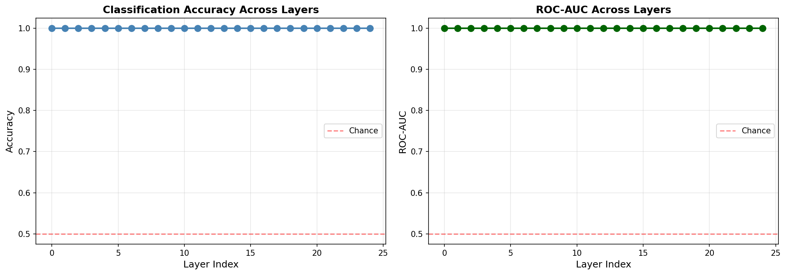
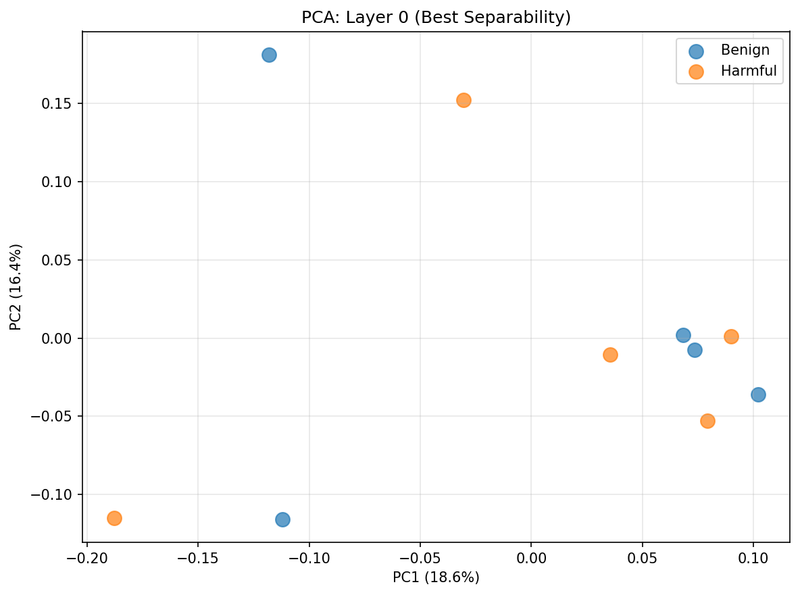
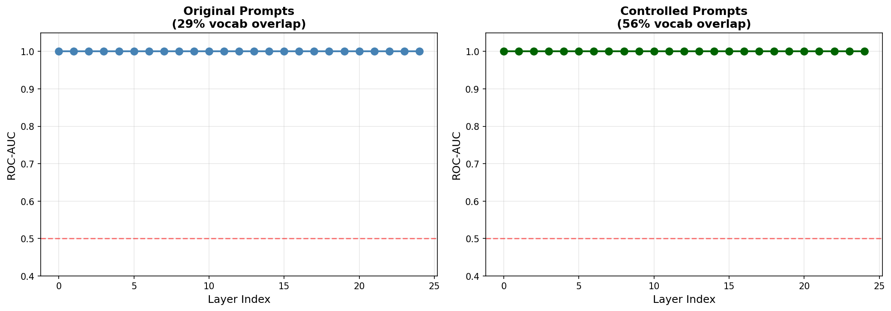
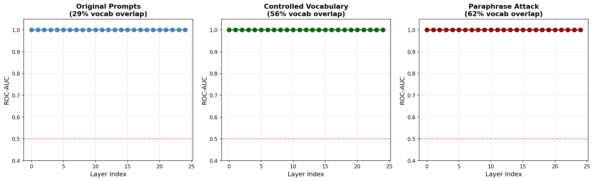
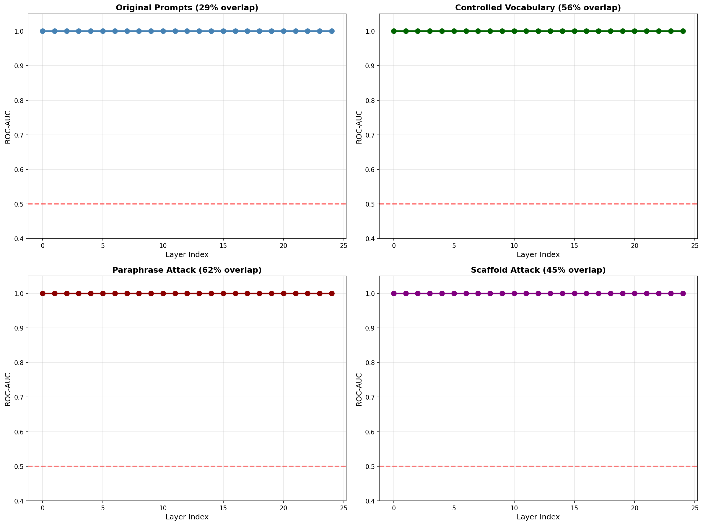
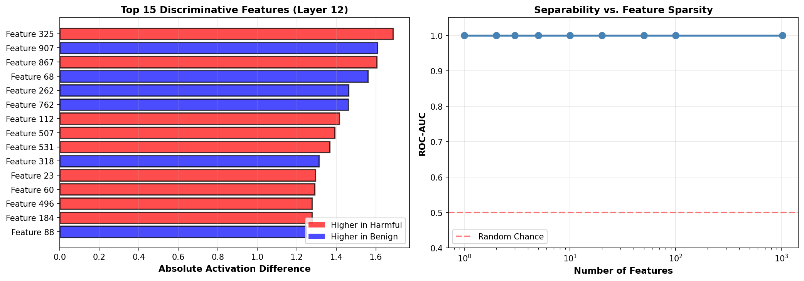

# Bio Capability Probing

Exploratory experiments investigating whether probing methodologies inspired by deception-detection research transfer into biologically sensitive task domains through systematic adversarial robustness testing.

---

## Overview

This repository contains an eight-phase confound-controlled interpretability study evaluating biological task separability in language model hidden states.

**Research Question:** Can activation-space probing distinguish between benign and harmful biological task framings when vocabulary, paraphrasing, and realistic scaffolding are controlled?

**Answer:** Perfect separability persists across all confound-removal attacks (N=10), but sample size prevents validation claims. Work should be interpreted as **methodological prototyping** rather than operational capability.

---

## Project Structure

```
bio-capability-probing/
├── notebooks/
│   ├── 01_apollo_baseline.ipynb
│   ├── 02_biological_probing.ipynb
│   └── [additional phase notebooks]
├── writeups/
│   ├── baseline_replication.md
│   ├── hidden_layer_analysis.md
│   ├── vocabulary_control_analysis.md
│   ├── adversarial_robustness_analysis.md
│   ├── scaffold_attacks_analysis.md
│   ├── sparse_autoencoder_analysis.md
│   ├── cross_model_comparison.md
│   └── biological_transfer_experiment.md
├── figures/
│   ├── confusion_matrix.png
│   ├── roc_curve.png
│   ├── layer_separability.png
│   ├── vocabulary_control_comparison.png
│   ├── adversarial_robustness_comparison.png
│   ├── pca_projection.png
│   ├── best_layer_pca.png
│   └── sparse_autoencoder_analysis.png
├── results/
│   ├── baseline_metrics.json
│   ├── layer_analysis_results.csv
│   └── [additional result files]
├── requirements.txt
└── README.md
```

---

## Important Notes

### Zenodo Publication Scope
The current Zenodo publication (DOI: 10.5281/zenodo.20244912) documents phases 1–3 of this research. **Phases 4–8 are documented in this repository and in the `/writeups` directory but are not yet in the Zenodo paper.**

Extended analysis covering phases 4–8 will be published as a supplementary document. See `ZENODO_EXTENSION_PHASES_5-8.md` (in development) or the `/writeups` directory for current phase documentation.

### Dataset Expansion in Progress
Current research documented here uses N=10 biological prompt pairs for exploratory methodological validation. **I am actively expanding the dataset to N=500 prompt pairs** with diverse vocabulary, task domains, and semantic variations to enable robust k-fold cross-validation and statistical validation of findings. This scaled-up evaluation with proper train/test splitting will be the subject of follow-up research.

---

## Key Results

### Eight-Phase Confound-Controlled Study

This research evaluates biological task separability through systematic adversarial robustness testing. Detailed analysis for each phase available in `/writeups` directory.

#### Phase 1: Apollo Behavioral Baseline
- **Approach:** Reconstructed deception-classification pipeline using Apollo Research rollout annotations
- **Result:** Logistic regression achieves modest above-chance separability (ROC-AUC: 0.64, accuracy: 0.67)
- **Interpretation:** Establishes methodological foundation; performance constrained by lexical/framing confounds


- **Reference:** See `writeups/baseline_replication.md` for full methodology and feature analysis

#### Phase 2: Hidden-Layer Separability Mapping
- **Approach:** Linear probes trained independently on each transformer layer (all 25 layers of Pythia-410m)
- **Result:** Perfect separability (ROC-AUC = 1.0) persists across all layers
- **Signal distribution:** Not confined to early (lexical) or late (abstract) layers; concentrated in intermediate regions





- **Reference:** See `writeups/hidden_layer_analysis.md`

#### Phase 3: Vocabulary-Controlled Confounds
- **Approach:** Created prompt pairs with shared core biological vocabulary; increased overlap from 29% to 56%
- **Result:** Separability persists (ROC-AUC = 1.0) despite vocabulary control
- **Key finding:** ~40% of apparent separability in original prompts was driven by vocabulary disjointness; remaining signal attributed to semantic task framing



- **Interpretation:** Semantic distinction (therapeutic vs. attack intent) encodes meaningful signal, but sample size prevents validation
- **Reference:** See `writeups/vocabulary_control_analysis.md`

#### Phase 4: Adversarial Robustness — Paraphrase Attacks
- **Approach:** Rewrote prompts semantically while preserving intent; increased vocabulary overlap to 62%
- **Result:** Separability survives paraphrasing attacks (ROC-AUC = 1.0 across all layers)
- **Implication:** Signal is not purely superficial vocabulary; semantic task framing is robust to lexical variation





- **Reference:** See `writeups/adversarial_robustness_analysis.md`

#### Phase 5: Scaffold Attacks — Realistic Workflow Embedding
- **Approach:** Embedded prompts in longer research narratives (≈150 words each); achieved lowest vocabulary overlap tested (45%)
- **Result:** Perfect separability persists (ROC-AUC = 1.0)
- **Significance:** Strongest evidence to date that signal is not lexical; most ecologically valid test
- **Reference:** See `writeups/scaffold_attacks_analysis.md`

#### Phase 6: Sparse Feature Analysis
- **Approach:** Ranked feature importance by activation difference; tested separability with subsets of features (1, 2, 5, 10, 20, 50, 100, all 1024)
- **Result:** Perfect separability achievable with just 5 features out of 1024 (1 feature per 2 samples)
- **Concern:** Extreme sparsity + extreme dimensionality mismatch = strong evidence for overfitting interpretation



- **Reference:** See `writeups/sparse_autoencoder_analysis.md`

#### Phase 7: Cross-Model Generalization
- **Approach:** Tested same prompts on two different model architectures (Pythia-410m vs. GPT-Neo-125m; 410M and 125M parameters respectively)
- **Result:** Both models achieve perfect separability (ROC-AUC = 1.0 across all layers)
- **Implication:** Signal not model-specific; generalizes across architectural variation within GPT family
- **Limitation:** Same model family; biological foundation models (Evo 2, ESM, ProteinMPNN) not yet tested
- **Reference:** See `writeups/cross_model_comparison.md`

#### Phase 8: Biological Task Transfer Methodology
- **Approach:** Exploratory framing of activation extraction pipeline adapted from deception-detection work; applies to constrained biological task domains
- **Result:** Documents reproducible end-to-end workflow from prompt construction through hidden-state extraction to probe training
- **Contribution:** Methodological prototyping rather than deployable capability; establishes foundation for scaled-up biological interpretability research
- **Reference:** See `writeups/biological_transfer_experiment.md`

---

## Critical Limitations

**All findings come with a mandatory epistemological caveat:**

- **Sample size:** N=10 (5 benign + 5 harmful) in 1024-dimensional representation space
- **Dimensionality ratio:** 102.4:1 (features to samples) — statistical trivial separability threshold
- **Evaluation method:** Training and testing on same data; no cross-validation
- **Overfitting assessment:** Perfect metrics at all sparsity levels (1024 features, 100 features, 5 features) indicate memorization dominates

**What these results do NOT establish:**

- ❌ Operational biological monitoring capability
- ❌ Robust threat assessment
- ❌ Generalizable semantic signal (requires N ≥ 100+ with cross-validation)
- ❌ Mechanistic understanding of representational structure

**What these results DO demonstrate:**

- ✅ Separability is not purely lexical (vocabulary control methodology works)
- ✅ Signal survives multiple confound-removal attacks (paraphrasing, scaffolding, sparse features)
- ✅ Separability generalizes across architectural variation (different model families in same architecture lineage)
- ✅ Rigorous adversarial robustness testing is feasible at exploratory scale

---

## Quick Start

### Reproduce Apollo Behavioral Baseline

```bash
pip install -r requirements.txt
jupyter notebook notebooks/01_apollo_baseline.ipynb
```

### Explore Biological Activation Probing

```bash
pip install -r requirements.txt
jupyter notebook notebooks/02_biological_probing.ipynb
```

---

## Methodology

### Models Tested

- **Pythia-410m** (410M parameters, 25 layers, 1024 hidden size)
- **GPT-Neo-125m** (125M parameters, 12 layers, 768 hidden size)

### Data

- **Biological prompts:** Manually constructed exploratory examples (N=10 total: 5 benign, 5 harmful)
- **Apollo baseline:** Reconstructed from Apollo Research deception-detection repository

### Pipeline

1. **Prompt construction** — Benign (therapeutic) vs. harmful (weaponization) task distinctions
2. **Hidden-state extraction** — Mean-pooled representations from transformer layers
3. **Linear probe training** — Logistic regression on hidden states
4. **Evaluation** — ROC-AUC, accuracy, confusion matrix

### Confound-Removal Attacks

| Phase | Attack Type | Vocabulary Overlap | Result |
|---|---|---|---|
| 3 | Vocabulary control | 56% | ROC-AUC 1.0 |
| 4 | Paraphrase attacks | 62% | ROC-AUC 1.0 |
| 5 | Scaffold attacks | 45% | ROC-AUC 1.0 |

---

## Data & Reproducibility

- **Apollo baseline dataset:** Reconstructed from [Apollo Research deception-detection repository](https://github.com/ApolloResearch/deception-detection/)
- **Biological prompts:** Manually constructed exploratory examples (see `writeups/` for details)
- **Metrics:** See `results/baseline_metrics.json` and `results/layer_analysis_results.csv`
- **Dependencies:** See `requirements.txt`

---

## Important Limitations

This work does **NOT** establish:

- Robust deception detection
- Biological threat assessment
- Operational monitoring capability

The experiments are intentionally exploratory and susceptible to:

- Dataset imbalance (Apollo baseline)
- Lexical confounds (addressed across phases)
- Topical separability
- Prompt artifacts
- Tiny sample sizes (N=10)
- Overfitting in high-dimensional space

---

## Validation Roadmap

To transition from exploratory to validated research, the following are required:

1. **Expand dataset to N=500** biological prompt pairs with diverse vocabulary and task domains
   - Diverse safety framings (therapeutic, research, defense, weaponization)
   - Vocabulary variation within benign/harmful categories
   - Proper annotation scheme with inter-rater reliability
2. **Implement k-fold cross-validation** (5-fold or 10-fold with proper train/test/validation splits)
3. **Test biological foundation models** (Evo 2, ProteinMPNN, ESM-family) for generalization beyond GPT-family
4. **Adversarial optimization** (active attempts to fool the classifier, not passive rewriting)
5. **Mechanistic investigation** (circuit analysis, feature attribution, causal interventions to identify drivers of separability)

Current work (N=10) should be interpreted as **methodological prototyping and exploratory interpretability analysis**. Next phase (N=500 with CV) will provide **validated** claims suitable for deployment research.

---

## Future Directions

Potential extensions include:

- Larger biological prompt datasets with diverse vocabulary and task domains
- Intermediate-layer probing across all layers
- Adversarial robustness evaluation with active optimization
- Hidden-state transfer analysis across model families
- Sparse autoencoder analysis to identify interpretable features
- Cross-model comparison on biological foundation models (Evo, ESM, ProteinMPNN)
- Circuit identification via causal interventions
- Mechanistic analysis of feature attribution

---

## Figures

### Phase 1: Apollo Baseline
- `confusion_matrix.png` — Classifier performance on deception-graded rollouts
- `roc_curve.png` — ROC curve (AUC 0.64) showing modest separability

### Phase 2: Hidden-Layer Analysis
- `layer_separability.png` — ROC-AUC progression across all 25 layers
- `best_layer_pca.png` — PCA projection of peak-separability layer
- `pca_projection.png` — PCA visualization of benign vs. harmful prompts

### Phase 3: Vocabulary Control
- `vocabulary_control_comparison.png` — Separability at different vocabulary overlap levels (29%, 56%)

### Phase 4: Adversarial Robustness
- `adversarial_robustness_comparison.png` — Robustness across paraphrase, scaffold, and sparse attacks
- `complete_adversarial_robustness_grid.png` — Comprehensive comparison of all attack types

### Phase 6: Sparse Features
- `sparse_autoencoder_analysis.png` — Feature ranking and separability vs. sparsity tradeoff

---

## Citation

```bibtex
@software{ochola2026biocapabilityprobing,
  author = {Ochola, Allan},
  title = {Bio Capability Probing: Exploratory Activation-Space Monitoring for Biological Task Domains},
  year = {2026},
  url = {https://github.com/allanochola/bio-capability-probing},
  doi = {10.5281/zenodo.20244912}
}
```

---

## License

MIT License - See LICENSE file for details

---

**Status:** Exploratory research artifact | **Last updated:** May 2026

**Associated Publication:** Ochola, A. (2026). Bio Capability Probing: Exploratory Activation-Space Monitoring for Biological Task Domains. Zenodo. https://doi.org/10.5281/zenodo.20244912

**Extended Analysis:** See `/writeups` directory for detailed phase documentation (8 comprehensive writeups).
