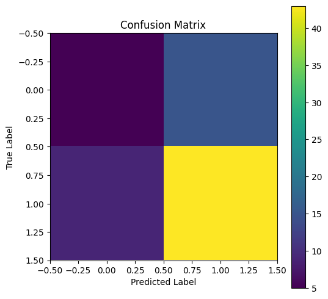
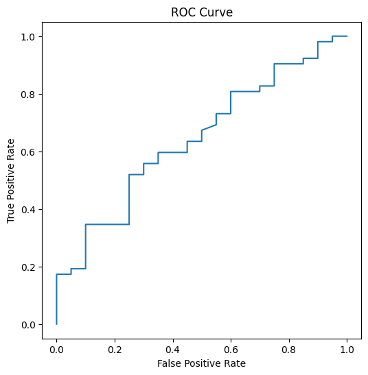

# Exploratory Behavioral Deception Classification Using Apollo Research Rollout Annotations

## Abstract

This exploratory study reconstructs a lightweight behavioral deception-classification pipeline using rollout annotations from the Apollo Research deception-detection repository.

The experiment evaluates whether text-level representations derived from model-generated outputs contain separable signal associated with deception-graded roleplaying scenarios. A logistic regression classifier trained over TF-IDF representations achieved modest above-chance separability between deceptive and non-deceptive outputs under constrained experimental conditions.

The primary contribution of this work is methodological reconstruction and exploratory analysis rather than robust deception detection or mechanistic interpretability.

---

# 1. Motivation

Recent work in mechanistic interpretability and deception detection has investigated whether model behaviors associated with deception leave recoverable signal in representations or outputs.

This project began as an exploratory effort to understand the structure of Apollo Research’s deception-detection datasets and reconstruct a minimal behavioral classification pipeline using publicly available rollout annotations.

Rather than attempting hidden-state probing or mechanistic circuit analysis directly, this baseline experiment evaluates a simpler question:

> Can lightweight text-level classifiers recover separable signal from deception-graded rollout outputs?

The goal is not to establish reliable deception detection, but to create a reproducible baseline for future interpretability-oriented extensions.

---

# 2. Dataset Reconstruction

The experiment used rollout data from:

```text
deception-detection/data/rollouts/roleplaying__plain__llama-70b.json
```

from the Apollo Research deception-detection repository.

Each rollout contained:

* prompt structure,
* generated assistant outputs,
* and deception-related annotations.

Important rollout fields included:

* `input_str`
* `output_strs`
* `graded_deception`

The `graded_deception` field appeared to represent deception severity or confidence scores ranging from 1–7.

To simplify the baseline setup:

* scores 1–3 were mapped to non-deceptive labels,
* scores 5–7 were mapped to deceptive labels,
* midpoint scores (`4`) were excluded.

This produced the following class distribution:

| Label         | Count |
| ------------- | ----- |
| Deceptive     | 257   |
| Non-Deceptive | 99    |

The resulting imbalance reflects the roleplaying-oriented nature of the dataset.

---

# 3. Methodology

## Text Representation

Model outputs (`output_strs`) were vectorized using TF-IDF representations with scikit-learn.

## Classifier

A logistic regression classifier was trained using:

* stratified train/test splitting,
* balanced class weighting,
* and standard evaluation metrics.

The experiment intentionally avoided:

* deep architectures,
* hidden-state extraction,
* or activation-level probing.

The objective was to establish a simple and interpretable behavioral baseline before moving toward mechanistic methods.

---

# 4. Results

## Quantitative Results

| Metric    | Score |
| --------- | ----- |
| Accuracy  | 0.67  |
| Precision | 0.74  |
| Recall    | 0.83  |
| ROC-AUC   | 0.64  |

The classifier achieved modest above-chance separability between deceptive and non-deceptive rollout outputs.

However, performance remained substantially weaker on the non-deceptive class.

---

# 5. Confusion Matrix Interpretation

## Confusion Matrix



|                    | Predicted Non-Deceptive | Predicted Deceptive |
| ------------------ | ----------------------- | ------------------- |
| True Non-Deceptive | 5                       | 15                  |
| True Deceptive     | 9                       | 43                  |

The classifier showed a strong tendency to predict deception, likely influenced by:

* dataset imbalance,
* roleplaying structure,
* and recurring linguistic patterns associated with deceptive scenarios.

The high false-positive rate for non-deceptive examples suggests that the model frequently interprets ambiguous conversational language as deceptive under this dataset distribution.

---

# 6. ROC Curve Interpretation

## ROC Curve



The ROC curve remained consistently above random baseline behavior, suggesting the presence of recoverable signal within the rollout outputs.

At the same time, the relatively modest ROC-AUC score indicates that separability remains weak and highly constrained under this simplistic setup.

The curve shape further suggests that the classifier relies on partial linguistic regularities rather than highly robust or strongly separable deception representations.

---

# 7. Feature Analysis

Inspection of logistic regression coefficients revealed that the classifier associated deception labels with features such as:

```text
just
really
sure
family
know
recently
good
fine
came
lot
```

These features suggest the classifier may be learning:

* conversational reassurance,
* excuse framing,
* emotional justification,
* and socially persuasive language patterns.

The feature `family` appeared strongly associated with deceptive outputs, likely reflecting common excuse-oriented roleplaying scenarios.

Features associated with non-deceptive outputs included:

```text
honestly
discuss
focus
activities
track
foundation
```

This raises an important interpretability question:

> Is the classifier learning deception itself, or merely socially stereotyped linguistic correlates associated with deceptive communication?

The current experiment cannot resolve this distinction.

---

# 8. Limitations

This baseline has several important limitations.

## Text-Level Only

The experiment operates entirely on lexical text representations rather than hidden activations or internal model states.

As a result, the classifier likely captures:

* stylistic regularities,
* semantic framing,
* and conversational structure,

rather than mechanistic representations of deception.

---

## Dataset Imbalance

The dataset contains substantially more deceptive than non-deceptive examples, which likely biases predictions toward the deceptive class.

---

## Roleplaying Artifacts

The roleplaying structure may introduce recurring linguistic templates that artificially increase separability.

---

## No Adversarial Evaluation

The experiment does not test robustness under:

* paraphrasing,
* role-switching,
* scaffolded prompting,
* or adversarial reformulation.

---

## No Mechanistic Interpretability

This project does not investigate:

* hidden-state representations,
* activation-space probing,
* sparse autoencoders,
* or circuit-level analysis.

---

# 9. Conclusion

This exploratory baseline reconstruction demonstrates that lightweight text-level classifiers can recover modest separability signal from Apollo deception-graded rollout outputs.

The results are insufficient for robust deception detection and likely rely heavily on linguistic and structural correlates.

Nevertheless, the experiment provides:

* a reproducible behavioral baseline,
* familiarity with alignment-oriented rollout datasets,
* and a foundation for future activation-space probing experiments.

The primary contribution is methodological reconstruction and exploratory analysis rather than deployment-ready deception monitoring capability.


